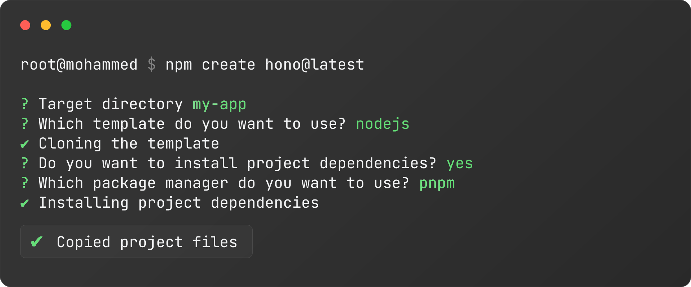

<div align="center">
  
  <h3>Create Hono</h3>
  Create a Hono application from
  <br />
  starter templates in seconds!

  <br />
  <br />

  
</div>

<br />

<br />

## Quick Start

Starter templates are available for each platform. Use one the following "create-hono" commands.

```bash
# npm
npm create hono@latest

# yarn
yarn create hono

# pnpm
pnpm create hono@latest

# bun
bun create hono@latest

# deno
deno run -A npm:create-hono@latest
```

## Options

### `--template`

You can specify the desired template from the command line. This is useful for automation, where you'd like to skip any interactive prompts.

```
npm create hono@latest ./my-app -- --template cloudflare-pages
```

### `--install`

Install dependencies after cloning template.

```
npm create hono@latest ./my-app -- --install
```

### `--pm <pnpm|bun|npm|yarn>`

Allows you to specify which package manager to use.

```
npm create hono@latest ./my-app -- --pm pnpm
```

## Author

Yusuke Wada <https://github.com/yusukebe>

and Hono contributors

## License

MIT

This project source code is based on **Create Solid** MIT Licensed.
<https://github.com/solidjs/solid-start/tree/main/packages/create-solid>
